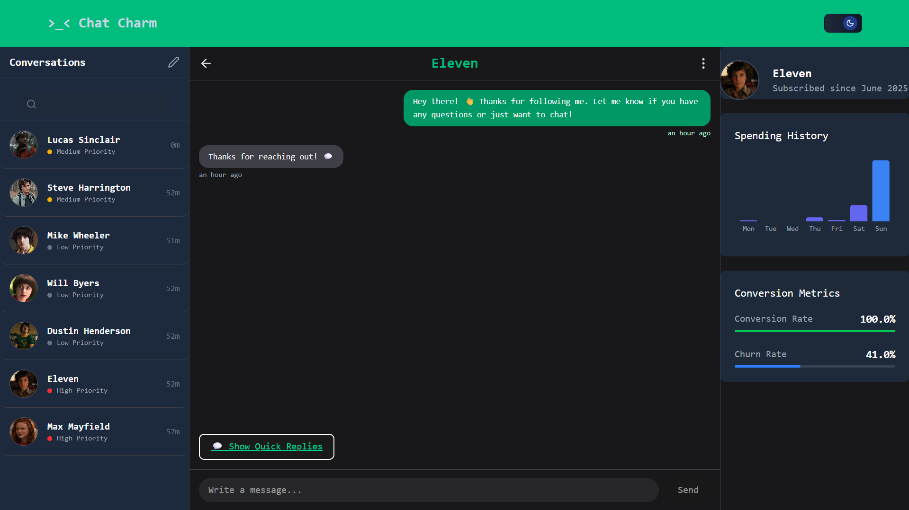
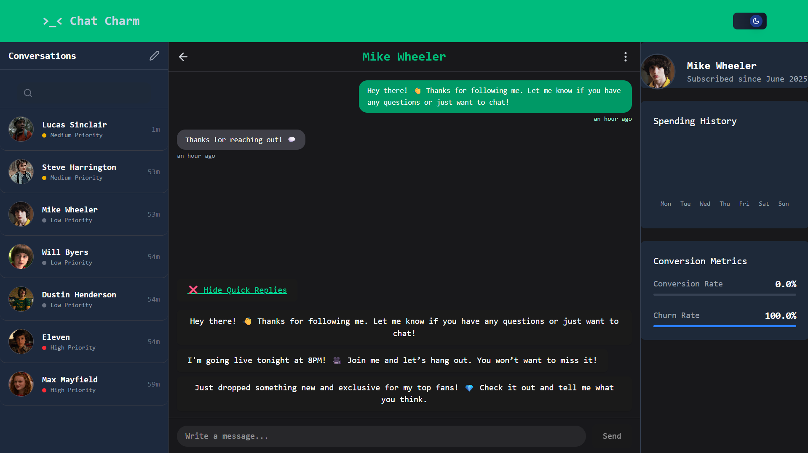
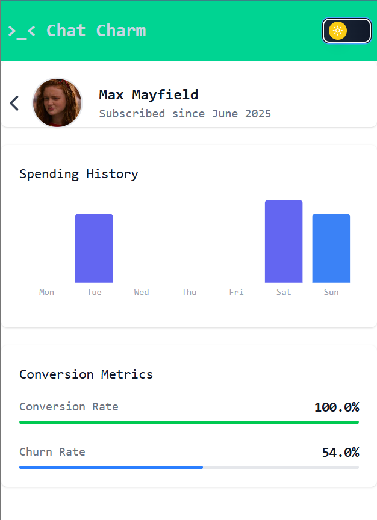
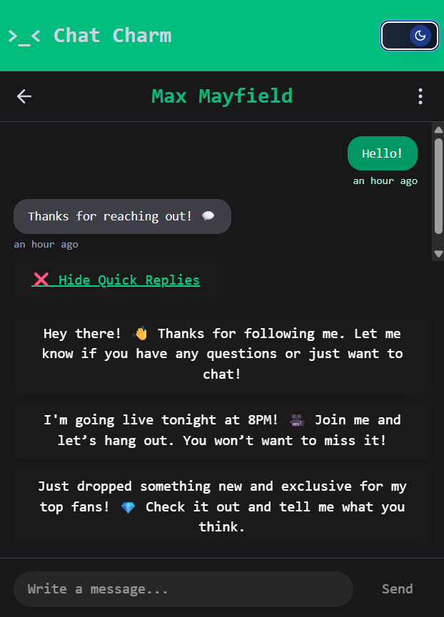
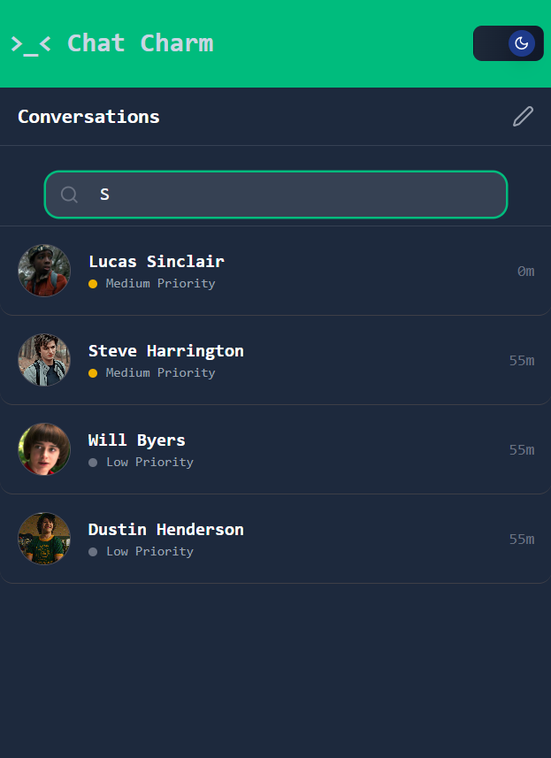

# >_< ChatCharm — Fan Engagement Dashboard

**ChatCharm** is a full-stack fan engagement dashboard prototype built to help  chatters manage fan interactions more efficiently. The app features real-time messaging, fan profiles, priority tagging, quick reply templates, and basic conversion analytics.

---

## 🚀 Features

- ✅ Responsive chat dashboard (mobile + desktop)
- 🌓 Dark mode support
- 💬 Real-time messaging with Socket.IO
- 🧠 Quick reply templates
- 🧍 Fan profile with spending history
- 📈 Basic analytics panel
- 🔄 Simulated AI typing + reply behavior

---

## 🛠 Tech Stack

| Frontend       | Backend          | Database       | Realtime   | Styling        |
|----------------|------------------|----------------|------------|----------------|
| React + Vite   | Node.js + Express| Prisma + SQLite| Socket.IO  | Tailwind CSS   |

---

## 📦 Installation

### 1. Clone the Repository

```bash
git clone https://github.com/csjames03/chatcharm.git
cd chatcharm

```
### 2. Install dependencies

```bash
cd backend
npm install

cd ../frontend
npm install
```

### 3. Push the dev database

#### ⚠️ Important: prisma/dev.db is included in the repository because the frontend code relies on seeded data (e.g. fan IDs, agent ID, and template IDs). You must use this database to avoid errors.
```bash
cd backend
npx prisma generate
npx prisma migrate dev
```

### 4. Start backend

```bash
cd backend
npm run dev
```

### 5. Start frontend

```bash
cd frontend
npm run dev
```


## API Reference

### `GET /api/conversations`

Returns a list of all fan conversations with name, priority, and latest message info.

### `GET /api/conversation/:id`

Returns message history for a specific conversation.

### `GET /api/fans/:id`

Returns fan profile and weekly spending data.

### `GET /api/templates`

Returns a list of quick reply templates.

### `POST /api/message`

Sends a new message.

**Required fields (JSON):**

```json
{
  "conversationId": "string",
  "text": "string",
  "senderType": "AGENT" | "FAN",
  "agentId": "string",     // required if senderType is AGENT
  "fanId": "string"       // required if senderType is FAN
}
```

---

## Real-time Messaging

* Messages are emitted via Socket.IO in real-time.
* Agent messages are sent via form or quick reply templates.
* A simulated typing indicator appears before fan replies.
* Replies from fans are delayed and automatically generated for demo/testing purposes.

---

## Notes for Reviewers

* Some IDs such as `agentId` and `fanId` are hardcoded into the frontend and backend.
* The app requires the `prisma/dev.db` file to run properly — this file includes seeded values (conversations, fans, templates). You may change these values later by seeding your own data or modifying the database schema.
* Templates used by the frontend are fetched via the `/api/templates` endpoint.

---

## Future Improvements

* 🔐 Authentication & session-based agent profiles
* 🧠 AI-assisted smart reply generation (LLM integration)
* 📊 More advanced analytics dashboard with charts
* 📩 Notification system for unread conversations
* 🔍 Search and filtering of conversations
* ✍️ Rich text or emoji support in messages
* 📁 Image/video/media message support

---

## 🖼️ Screenshots

### Dashboard View
#### Big Screen 


#### Small Screen 


### Conversation  View
#### Small Screen 



### Conversation List  View
#### Small Screen 



---


